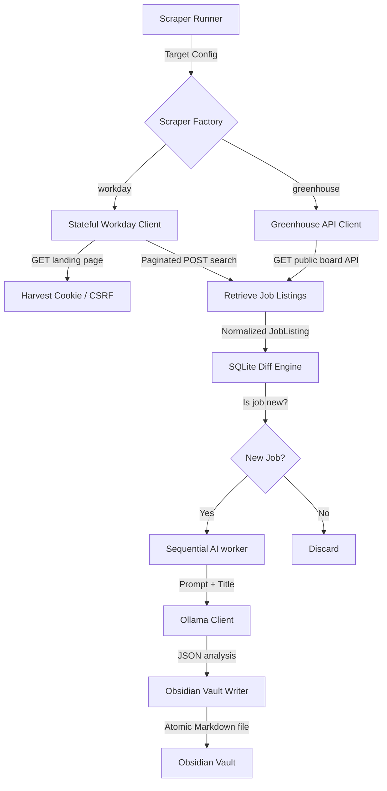

# Architecture Overview

`openHunt` is designed as a sovereign, local-first market intelligence engine. It collects listings from Workday CXS and Greenhouse job-board APIs, persists new listings to a local SQLite database, analyzes them using a local Ollama LLM, and exports structured findings to an Obsidian vault.

## System Layout

## 1. ATS Scraping Clients (`internal/scraper`)

The scraper factory selects a backend from each target company's `platform`. Both backends normalize their responses into the shared `JobListing` model.

Workday job boards require a stateful session to prevent CSRF exploits and verify web browser authenticity. The Workday client uses a Go `cookiejar` and splits execution into two phases:

1. **GET Request (Token Harvesting)**: A `GET` request is made to the main public-facing landing page of the career portal (e.g. `https://illumina.wd1.myworkdayjobs.com/en-US/illumina-careers/`). This forces Workday to initialize the session and drop the `CALYPSO_CSRF_TOKEN` cookie.
2. **POST Request (JSON query)**: A `POST` request containing a specific JSON payload is made to the internal API endpoint (e.g. `https://{tenant}.wd1.myworkdayjobs.com/wday/cxs/{tenant}/{site}/jobs`). The CSRF token is extracted from the cookie jar and set in the `X-Calypso-Csrf-Token` header.

The Workday client resolves dynamic facet IDs, remaps location facets as required, and paginates through every result page with a jittered delay.

The Greenhouse client reads the public boards API and applies normalized category, country, and location filters. Remote matching is intentionally relaxed to support values such as `Remote, US`.

## 2. SQLite Diff Engine (`internal/db`)

To avoid querying the LLM for identical, previously processed jobs, a local SQLite database (`database/openhunt.db`) is used as a deduplication layer:
- The database stores job IDs, metadata, and the cached AI analysis results.
- Incoming scraped jobs are run through `IsJobNew(jobID)`. If a job ID already exists, it is bypassed, saving computing resources.

## 3. Sequential AI Worker & Ollama (`internal/telemetry`)

Jobs that pass the diff engine are queued sequentially for local LLM processing:
- A worker pulls jobs from the queue and sends their titles/descriptions to a local Ollama server running a model (e.g. `llama2:latest`).
- Ollama is configured to output structured JSON mapping fields like salary range (`base_salary_min`/`base_salary_max`), `tech_stack`, `regulatory_gates`, and `role_type`.

## 4. Obsidian Vault Export (`internal/telemetry`)

The final analysis is written to an Obsidian vault (`Market-Insights/`) as atomic Markdown files:
- The files contain frontmatter conforming to YAML specifications.
- This allows job seekers to search, filter, and link intelligence details directly within their Obsidian workspaces.
