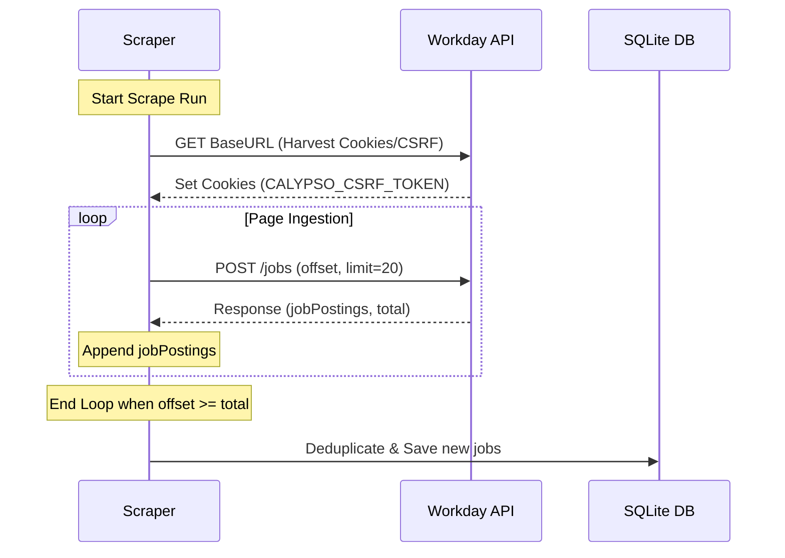

# Technical Design: Workday Scraper Pagination

> **Status**: Implemented and verified as of 2026-06-21. The production implementation uses 20-result pages and randomized 200–500ms delays.

## 1. System Context & Data Flow
The Workday scraper client is defined in `internal/scraper/client.go`. It sends a POST request with a JSON payload to the Calypso CXS endpoint.



## 2. Detailed Changes

### `internal/scraper/client.go`
Modify `FetchJobs` and `fetchJobsAt` to loop and collect results:
- Modify `fetchJobsAt(targetURL string)` to return a list of `JobListing` and an `error`.
- Convert `fetchJobsAt` into an iterative paging process.
- Set the payload limit to `20`, matching the implemented and verified Workday request behavior.
- Maintain a local slice `allJobs []JobListing`.
- Loop until `len(allJobs) >= total` or the API returns an empty `jobPostings` slice.
- Respect rate limiting by adding a sleep parameter (e.g., `time.Sleep(500 * time.Millisecond)`) between requests if paginating.

### Example Signature and Loop
```go
func (c *WorkdayScraper) fetchJobsAt(targetURL string) ([]JobListing, error) {
	var allJobs []JobListing
	limit := 20
	offset := 0

	for {
		reqPayload := WorkdayRequest{
			AppliedFacets: make(map[string][]string),
			Limit:         limit,
			Offset:        offset,
			SearchText:    "",
		}

		jsonData, err := json.Marshal(reqPayload)
		if err != nil {
			return nil, fmt.Errorf("failed to marshal request payload: %w", err)
		}

		req, err := http.NewRequest("POST", targetURL, bytes.NewBuffer(jsonData))
		if err != nil {
			return nil, fmt.Errorf("failed to create request: %w", err)
		}

		// Set headers...

		resp, err := c.httpClient.Do(req)
		if err != nil {
			return nil, fmt.Errorf("request at offset %d failed: %w", err)
		}

		// Check status...
		
		var workdayResp WorkdayResponse
		if err := json.NewDecoder(resp.Body).Decode(&workdayResp); err != nil {
			resp.Body.Close()
			return nil, fmt.Errorf("failed to decode response at offset %d: %w", err)
		}
		resp.Body.Close()

		allJobs = append(allJobs, workdayResp.JobPostings...)

		if len(allJobs) >= workdayResp.Total || len(workdayResp.JobPostings) == 0 {
			break
		}

		offset += limit
		
		// Polite scraping delay
		time.Sleep(time.Duration(200+rand.Intn(300)) * time.Millisecond)
	}

	return allJobs, nil
}
```

## 3. Testing and Verification Plan
1. **Unit Tests**:
   - Write/update `client_test.go` to mock the Workday paginated endpoints returning multiple pages.
   - Assert that the scraper correctly terminates when the end is reached and correctly aggregates all pages.
2. **Integration Verification**:
   - Run the scraper against `Illumina` target and verify in database output logs that pagination occurs and all historical jobs are parsed.
